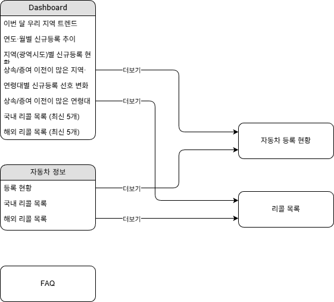

## 📌 프로젝트 명  

#### 무한동력


## 📅 프로젝트 기간  
#### **2025.12.06 ~ 2025.12.11 (총 6일)**

# 👥 프로젝트 팀 및 역할  

#### 팀명: 무한상사

| 정유선 | 강승원 | 송주엽 | 신승훈 |
|:----------:|:----------:|:----------:|:----------:|
|   |   |  | 
| [@jys96](https://github.com/jys96) | [@chopa4452](https://github.com/chopa4452) | [@JUYEOP024](https://github.com/JUYEOP024) | [@seunghun92-lab](https://github.com/seunghun92-lab) |

- **정유선: 팀장, PM, 화면설계, Front개발**
- **강승원: DB설계, AWS 서버생성, 크롤링(데이터 저장)**
- **송주엽: Back개발**
- **신승훈: 크롤링(데이터 수집)**

---

## 🚗 프로젝트 주제  

<ol>
    <li>연도·월별 신규등록 추이 대시보드</li>
    <li>지역(광역시도)별 신규등록 현황 비교</li>
    <li>연령대별 신규등록 선호 변화(연료·차종 중심)</li>
    <li>상속/증여 이전이 많은 지역·연령대 조합 찾기</li>
    <li>이번 달 우리 지역 트렌드 3줄” 자동 요약</li>
    <li>리콜 데이터 분석</li>
    <li>자동차 브랜드별 FAQ 수집</li>
</ol>

---

## 개요
본 프로젝트는 자동차 등록 통계(엑셀 기반 데이터)와 **리콜/FAQ 정보**를 하나의 포털에서 조회할 수 있도록 구성한 데이터 기반 대시보드입니다.  
사용자는 대시보드에서 **연도·월 / 지역(광역시도) / 연령대 / 연료 / 차종** 등을 기준으로 신규등록 추이와 분포를 비교하고, 자동차 정보(리콜/FAQ) 페이지에서 추가 정보를 확인할 수 있습니다.

- **프로젝트 명**: 무한동력  
- **프로젝트 소개**: 차량 등록 현황·리콜·브랜드 FAQ를 통합 조회/분석하는 Streamlit 기반 웹 앱  
- **프로젝트 필요성(배경)**  
  - 자동차 등록 데이터는 항목이 많고(지역/연령/연료/차종 등) 월 단위로 누적되기 때문에, 단순 엑셀 분석만으로는 **반복 작업과 오류 가능성**이 커집니다.  
  - 반복되는 분류값(시도/연료/연령대 등)을 별도로 관리하고, 집계 수치(보유/변동)를 Fact로 분리한 구조가 필요했습니다.  
- **프로젝트 목표**  
  1) 월/연도별 신규등록 추이를 한눈에 볼 수 있는 대시보드 제공  
  2) 지역별·연령대별·연료별 패턴을 교차 분석할 수 있는 필터/차트 구성  
  3) AWS RDS(MySQL)에 데이터를 적재하고, 중복 방지/무결성(FK)/조회 성능(인덱스)을 고려한 스키마 설계  
  4) (확장) 브랜드 FAQ를 수집·정제하여 DB에 저장하고, 서비스 화면에서 검색/조회 가능하도록 기반 마련  

**데이터 흐름(요약)**: Excel(.xlsx) → 전처리/검증 → MySQL(RDS) 적재 → Streamlit 화면 조회/시각화

---

## 🛠 기술스택  
<div>
    
    
    
    
    
</div>


## 📦 사용 라이브러리  
<div>
    
    
    
</div>
<div>
    
     
    
    
</div>

---

## WBS
프로젝트 기간(6일) 동안의 작업을 기능 단위로 쪼개고, 병렬로 진행 가능한 항목(화면/DB/크롤링/백엔드)을 분리하여 진행했습니다.

| 날짜 | 주요 작업 | 비고 |
|---|---|---|
| 12/06 | 주제/요구사항 정리, 화면 구조 초안, ERD 방향 합의 | 기획 |
| 12/07 | AWS 인프라(EC2/SSH/RDS) 연결, DB 스키마 초안 | 환경 구축 |
| 12/08 | Dim/Fact 테이블 확정, 적재 스크립트(엑셀→DB) 작성 | 데이터 파이프라인 |
| 12/09 | FAQ/리콜 수집 로직 프로토타입, 저장 로직(중복 방지) | 크롤링 |
| 12/10 | Streamlit 페이지 연결, 주요 쿼리/시각화 적용, UI 다듬기 | 통합 |
| 12/11 | 테스트/버그 수정, 문서 정리, 발표 자료 준비 | 마감 |

---

## 요구사항 명세서
### 기능 요구사항
- **대시보드**
  - 연도/월 선택 및 주요 지표(등록 추이, 분포) 시각화
  - 지역(광역시도) 기준 비교(필터/정렬/상위 N)
- **자동차 정보**
  - 등록 현황: 조건별 조회(지역/연료/차종/용도 등)
  - 리콜 목록: 리콜 데이터 조회 및 검색
- **FAQ**
  - 브랜드별 FAQ 조회/검색
  - 크롤링 데이터의 중복 저장 방지(해시/유니크 키 기반)

### 비기능 요구사항
- 동일 데이터 재적재 시에도 결과가 깨지지 않도록 **중복 방지(UNIQUE/UPSERT)** 적용
- Dim 기준값과의 연결을 통해 **데이터 무결성(FK)** 확보
- 대시보드 조회 성능을 위해 주요 컬럼에 **인덱스** 적용


---

## 📊 테마(색상, 글꼴, 폰트사이즈) 정의
1. #### 글꼴
    1. 한글: Pretendard(파일), 나눔스퀘어(파일), Noto Sans(google font)
    2. 영어: Wanted(파일), Roboto(google font), Open Sans(google font)
2. #### 글꼴 크기
    1. 제목: 26 / 44
    2. 본문: 16
3. #### 색상 코드
    1. 전체 배경: f9fafb
    2. 포인트: 2D6CDF(블루), 1A237E(네이비)
    3. 검정: 242424
    4. 회색
        1. 배경: F0F0F0
        2. 테두리: D7D7D7
        3. 일반: 7C7C7C
    5. 빨강: DB403E / 배경: 10%
    6. 주황: FF6200 / 배경: 10%
    7. 초록: 2AA971 / 배경: 10%
    8. 파랑: 165DFB / 배경: 10%
    9. 보라: 7331DE / 배경: 10%

---

## 페이지 구조
```

무한동력 사이트
   ├── Dashboard (main)
   ├── 자동차 정보
   │      ├── 등록 현황
   │      └── 리콜 목록
   └── FAQ
  
```

## 화면흐름도(User Flow) - drawio 이용



## 사이트맵 - Reuim AI 이용


## 와이어프레임 - Figma 이용
[figma](https://www.figma.com/make/NF62EN7yowhloH7yQJ6YgQ/Automobile-Information-Portal?node-id=0-4&t=pWJfjHQiu0ZhqYPm-1)

[수정 PDF](https://drive.google.com/file/d/1sIaXJYfz4rFcwJFopfZ7n4z3vrZ3eBPM/view?usp=drive_link)


---

## 🗂 DB ERD
[ERD CLOUD](https://www.erdcloud.com/d/DTdTnd45mJxarhuwd)


---

## 데이터 베이스 서버 구축


---

## 프로젝트 구조
```
project_1st_4team/
├── .venv/                         # 가상 환경 (git X )
│
├── backend/                       # 핵심 백엔드/데이터 처리 패키지
│   ├── db_main/                   # DB 저장/조회 레이어 (Repository)
│   ├── bmw_faq.py
│   ├── car_faq.py                 # FAQ DB 저장/조회
│   ├── car_recall.py
│   ├── car_repository.py          # 등록/차량 기본정보 DB 레이어
│   ├── database.py                # DB 연결 설정
│   ├── dim_tables.py
│   ├── flow_repository.py         # 유입/흐름 데이터 저장/조회
│   ├── kia_faq.py
│   ├── load_fact_flow_count.py
│   ├── load_fact_fuel_stock.py
│   ├── load_fact_owner_demo_stock.py
│   ├── load_fact_vehicle_stock.py
│   ├── owner_repository.py
│   └── recall_repository.py       # 리콜 DB 저장/조회  
│
├── project_crawling/              # 크롤링 스크립트 폴더 모음
│   ├── benz.py                    # 더보기 버튼 클릭 처리
│   ├── hyundai.py                # 페이지별 FAQ 항목 반복 추출
│   └── kia_faq.py                 # 질문/답변 추출 및 CSV 저장
│
├── assets/                        # 정적 파일 모음
│   ├── car_excel_files/           # 자동차 등록 통계 엑셀 파일
│   ├── charts/                    # GIS/지도/차트용 shp, prj 파일
│   ├── fonts/                     # 폰트 파일들
│   └── images/                    # 화면/ERD/시스템 구성도 이미지
│
├── views/                         # Streamlit 멀티 페이지 정의 폴더
│   ├── Dashboard.py               # 대시보드
│   ├── CarInfo.py                 # 자동차 정보
│   ├── CarRegistrationList.py     # 2-1 자동차 등록 현황
│   ├── RecallList.py              # 2-2 리콜 목록
│   ├── Map.py                     # 지도 기반 통계
│   └── FAQ.py                     # FAQ 페이지
│
├── .streamlit/
│   └── config.toml                # Streamlit UI/Theme 설정
│
├── streamlit_app.py               # Streamlit 메인 앱 시작 파일
├── requirements.txt               # 프로젝트 의존성 목록
└── README.md                      # 프로젝트 문서
```
## 모듈 구조/명세서

프로젝트는 **데이터 적재(ETL) / DB 접근(Repository) / 크롤링 / 화면(Streamlit)** 영역으로 나누어 구성했습니다.

| 구분 | 위치(폴더/파일) | 역할 |
|---|---|---|
| Streamlit 엔트리 | `streamlit_app.py` | 앱 실행/메인 네비게이션 |
| 화면(View) | `views/` | Dashboard, CarInfo, FAQ 등 페이지 단위 화면 |
| DB 연결 | `backend/database.py` | RDS(MySQL) 연결 및 커서 관리 |
| Repository | `backend/*_repository.py` | 조회/저장 SQL을 기능 단위로 분리 |
| Dim 기준값 | `backend/dim_tables.py` | dim 테이블 생성/초기값 관리 |
| Fact 적재 | `backend/load_fact_*.py` | 엑셀/원천 데이터 → fact 테이블 적재 |
| 크롤링 | `project_crawling/*.py` | 브랜드/리콜/FAQ 수집 스크립트 |

### 실행 흐름(요약)
```txt
(1) RDS 연결 확인 → (2) Dim 테이블 준비 → (3) Fact 적재 스크립트 실행
→ (4) Streamlit 실행(streamlit_app.py) → (5) 화면에서 필터/조회/시각화
```

---

## 개발 화면

아래는 프로젝트 구현 방식이 잘 드러나는 핵심 코드 예시 2가지입니다. (DB 적재 안정성 / FAQ 중복 방지)

### 1) Fact 테이블: 중복 방지(UNIQUE) + 무결성(FK) + 조회 성능(Index)
- 월/지역/연료/차종/사업구분 조합이 동일한 데이터가 2번 들어오는 것을 방지하기 위해 **복합 UNIQUE KEY**를 설정했습니다.
- Fact에는 문자열 대신 dim id(FK)를 저장해 저장공간과 조인 성능을 확보했습니다.

```sql
CREATE TABLE IF NOT EXISTS fact_fuel_stock (
  fuel_stock_id BIGINT UNSIGNED NOT NULL AUTO_INCREMENT,
  year          INT NOT NULL,
  month         INT NOT NULL,
  sido_id       INT UNSIGNED NOT NULL,
  fuel_id       INT UNSIGNED NOT NULL,
  vehicle_kind  VARCHAR(10) NOT NULL,
  business_type VARCHAR(10) NOT NULL,
  stock_count   INT NOT NULL DEFAULT 0,
  PRIMARY KEY (fuel_stock_id),

  UNIQUE KEY uq_fact_fuel_stock (year, month, sido_id, fuel_id, vehicle_kind, business_type),

  KEY idx_ffs_sido (sido_id),
  KEY idx_ffs_fuel (fuel_id),
  KEY idx_ffs_ym (year, month)
);
```

### 2) FAQ 저장: 해시(uniq_hash) 기반 중복 방지 + 재실행 안전(Upsert)
- FAQ는 문장 기반 데이터라 동일 항목이 재수집될 수 있어, **brand+question+answer** 조합을 해시로 만들어 유일성을 확보했습니다.
- `ON DUPLICATE KEY UPDATE`로 재실행 시에도 중복 insert가 아닌 업데이트로 처리해 안정적으로 운영할 수 있습니다.

```python
import re, hashlib
from datetime import datetime

def normalize_text(s: str) -> str:
    return re.sub(r"\s+", " ", (s or "").strip())

def make_hash(brand: str, question: str, answer: str) -> str:
    raw = f"{brand}|{normalize_text(question)}|{normalize_text(answer)}"
    return hashlib.sha256(raw.encode("utf-8")).hexdigest()

sql = """
INSERT INTO faq (brand, category, question, answer, uniq_hash, created_at)
VALUES (%s, %s, %s, %s, %s, %s)
ON DUPLICATE KEY UPDATE
  answer = VALUES(answer),
  category = VALUES(category);
"""

uniq_hash = make_hash(brand, question, answer)
cursor.execute(sql, (brand, category, question, answer, uniq_hash, datetime.now()))
```


---

## 📄참고 자료

### 1) DB 설계 기준(Dim / Fact)
- **Dim 테이블**: 반복되는 “분류 기준(라벨/카테고리)”을 관리  
  - 예) 시도(서울/경기), 연령대(20대/30대), 연료(휘발유/전기/수소), 변동 세부유형 등
- **Fact 테이블**: 실제 분석 대상이 되는 “집계 수치(숫자)” + 그 수치가 의미를 갖는 키(dim id)  
  - 예) 보유대수(`stock_count`), 변동건수(`flow_count`)

**Dim/Fact를 분리한 이유(요약)**  
- 중복 제거 및 데이터 품질 확보(복합 UNIQUE)  
- 저장공간/성능 개선(문자열 반복 저장 방지, 인덱스 효율)  
- 분류 기준의 일관성 유지(검증/표준화)  
- FK로 무결성 보장(존재하지 않는 기준값 입력 차단)

### 2) 인프라/접속 참고(EC2 + RDS)
- EC2 접속(SSH)
```bash
ssh -i "D:\SKN.pem" ec2-user@ec2-13-61-174-247.eu-north-1.compute.amazonaws.com
```
- RDS(MySQL) 접속(EC2 내부)
```bash
mysql -h skn23-1st-4team.cr6u26mg6lbq.eu-north-1.rds.amazonaws.com -u admin -p
```
- DBeaver(SSH Tunnel) 설정  
  - Host: `skn23-1st-4team.cr6u26mg6lbq.eu-north-1.rds.amazonaws.com` / Port: `3306`  
  - SSH Host: `ec2-13-61-174-247.eu-north-1.compute.amazonaws.com` / SSH User: `ec2-user` / Key: `SKN.pem`

### 3) ERD
- ERD Cloud: https://www.erdcloud.com/d/DTdTnd45mJxarhuwd


[노션 바로가기](https://www.notion.so/2c15b4cf83ab8053b1c4ffa904342e6b?v=2c15b4cf83ab80eebddb000ca1f45b53&source=copy_link)


### 4) FAQ 크롤링
- **Python + Selenium + Chrome WebDriver를** 활용하여 Mercedes FAQ, Kia FAQ, Hyundai FAQ 페이지 크롤링
- **F12 개발자 도구**로 **HTML 구조 확인, CSS Selector** 사용하여 질문(header)과 답변(div.toggle) 추출
- 쿠키 동의 버튼 클릭, **'더보기'** 버튼 클릭 등 동적 페이지 대응
CSV 파일로 질문/답변 저장, 반복문과 예외 처리로 모든 FAQ 항목 안정적으로 수집

```python
 # '더보기' 버튼 클릭(div.toggle)
  try:
    more_btn = faq.find_element(By.CSS_SELECTOR, "div.toggle")
    driver.execute_script("arguments[0].click();", more_btn)
    time.sleep(0.2)
  except:
    pass
```

---

## 트러블 슈팅

####  강승원
- RDS 연결 과정에서 pem 권한 문제로 SSH가 거부되는 이슈가 있었고, Windows 보안 설정을 조정해 해결했습니다.
- Fact 적재 시 같은 조합이 중복으로 들어가는 문제는 복합 UNIQUE KEY와 upsert 방식으로 재실행 안정성을 확보했습니다.
- 브랜드별 FAQ는 페이지 구조/문장 형태가 달라 파싱 규칙을 통일하기 어려워, 브랜드별 크롤러를 분리하고 해시(uniq_hash)로 중복 저장을 방지했습니다.


프로젝트 진행 중 특히 시간이 많이 소요됐던 이슈는 **AWS RDS 접속/권한**, **Dim/Fact 설계**, **FAQ 크롤링/저장 규칙** 3가지였습니다.

- **pem 권한 문제(UNPROTECTED PRIVATE KEY FILE / Bad permissions)**  
  - 원인: Windows에서 pem 파일 권한이 너무 열려 SSH가 키를 거부  
  - 해결: pem 파일을 “내 계정만 Read”로 제한(상속 해제 후 다른 사용자 제거)
- **DBeaver는 성공, 터미널 SSH는 실패**  
  - 원인: 경로 따옴표/권한/사용자명(ec2-user) 차이로 발생  
  - 해결: pem 경로를 따옴표로 감싸고 권한 재설정, SSH 명령 재검증
- **RDS Access denied**  
  - 원인: 비밀번호 오타, 계정 권한, 접속 경로(터널 여부) 문제  
  - 해결: 계정/비밀번호 재확인 + SSH 터널 경유 접속 확인
- **중복 데이터 적재(엑셀→DB 재실행 시 중복 증가)**  
  - 해결: fact 테이블에 복합 UNIQUE를 두고, 필요 시 upsert(또는 insert ignore) 전략 적용
- **FAQ 데이터 구조 차이(브랜드별 문서/HTML 구조가 다름)**  
  - 해결: 브랜드별 파서 분리 + 질문/답변 분리 규칙(예: `?` 기준) + 해시 기반 중복 방지


####  정유선


####  송주엽
- **화면과 API 응답 구조 불일치**
  - 원인:백엔드 중심으로 API를 먼저 설계하여 화면 레이아웃과 실제 데이터 사용 흐름이 충분히 반영되지 않음
  ```   
  -해결방법-
  1) 화면 레이아웃을 기준으로 필요한 데이터 항목을 먼저 정의
  2) 등록현황 / 리콜 / FAQ 기능별 API 명세서 작성
  3) 명세를 기준으로 API 응답 구조 재정비
   ```
- **기능 추가 시 코드 가독성과 유지보수성이 저하됨**
  - 원인:초기 설계 단계에서 기능 단위 분리가 충분하지 않음 
  ```   
  -해결방법-
  1) DB 접근 로직을 Repository 패턴으로 분리
  2) 공통 기능을 utils 디렉토리로 정리
  3) 도메인 기준(등록현황 / 리콜 / FAQ)으로 구조 분리
   ```
  
- **등록 대수, 통계 수치 계산 시 소수점 오차 발생**
  - 원인:Python float 타입의 부동소수점 방식으로 인한 계산 오차
  ```
  -해결방안-
   정확한 계산이 필요한 경우 decimal 타입 사용
  from decimal import Decimal

  value = Decimal("0.1") + Decimal("0.2")
  ```

####  신승훈
- 동적 웹 페이지 크롤링: **Chrome WebDriver**를 사용하여 버튼 클릭, 탭 이동, **Shadow DOM** 접근 등 사용자 액션을 자동화하였습니다.
- 쿠키/팝업 처리: 사이트별 쿠키 동의 팝업과 안내창에 대응하여 데이터 누락을 최소화하였습니다.
- 페이지 로딩 안정성: **Python Selenium**에서 **WebDriverWait**와 명시적 대기를 활용하여 JavaScript 렌더링 후 요소에 안정적으로 접근할 수 있도록 하였습니다. 

프로젝트 진행 중 어려움을 겪었던 이슈는 **브랜드별 FAQ 크롤링**, **페이지 질문/답변 혼합 문제**, **크롤링 속도 문제** 3가지였습니다.

- **브랜드별 FAQ 크롤링**
- 원인: 페이지 구조 및 문장 형태가 브랜드마다 상이하여 단일 파서로는 데이터를 정확하게 추출하기 
- 해결: 브랜드별로 파서를 분리하여 맞춤형 크롤링 구현

- **페이지 질문/답변 혼합 문제**
- 원인: 질문과 답변이 페이지 내 혼합되어 있어 중복 저장과 정확한 분리가 어려움
- 해결: 질문과 답변을 기준으로 데이터를 분리하고, CSV 파일로 저장하며 중복 방지를 위해 해시(uniq_hash)를 적용

- **크롤링 속도 문제**
- 원인: 불필요한 반복 액션으로 인해 크롤링 속도가 느려짐
- 해결: 반복 액션을 최소화하고 CSV 적재 방식을 최적화하여 크롤링 속도를 향상


---

### 💬 팀원별 회고

####  정유선
> 안녕하세요! 이번 학원 팀 프로젝트의 팀장이자, 총괄 매니저 겸 화면 설계 담당, 그리고 프론트엔드 개발자까지 1인 다역을 소화한 정유선입니다! 🥳

> 처음 기획 단계에서는 '이것도 하고 싶고, 저것도 멋있을 것 같고!' 하는 욕심이 마구마구 샘솟아서 점점 커져 버렸습니다.
그러다 보니 마감일이 다가올수록 "조금만 더... 조금만 더 손보면 대박일 텐데!" 하는 아쉬움이 쬐끔 남는 프로젝트가 되었어요. 시간이 정말 순삭이라는 걸 뼈저리게 느꼈답니다!

> 막바지에는 혹시라도 프로젝트 완성이 늦어질까 봐 저도 모르게 마음이 조급해져서 팀원 친구들에게 잔소리 요정이 되어 버린 것 같아요. 
'이거 얼른 해주세요!', '저거 언제 돼요?' 하면서 푸시를 엄청나게 했는데... 그럼에도 불구하고 끝까지 저의 엉뚱한 열정과 속도를 찰떡같이 맞춰준 우리 팀원들! 정말 고맙고 또 고마워요! 
덕분에 무사히 프로젝트를 마무리할 수 있었답니다. 다들 최고 최고! 👍

>이번 프로젝트를 통해 정말 많은 것을 배우고 느꼈어요. 다음에는 욕심도 좀 줄이고(?) 시간 관리도 더 잘해서, 모두가 만족하는 더 완벽한 작품을 만들어보고 싶습니다! 
모두 수고 많으셨습니다!

####  강승원
> 한줄소감: 세부주제에 따라 데이터베이스 테이블 설계를 어떻게 하면 가능한 범위(지식)에서 효율적으로 관리할 수 있는지를 고민하는 과정이 쉽지 않았습니다.

> 여기에 각 브랜드별 FAQ·통계 데이터를 크롤링해 직접 수집하고 정제해 보면서, ‘설계–수집–저장’까지 한 흐름으로 이어지는 데이터 파이프라인의 느낌을 처음으로 익혀볼 수 있었습니다.

####  송주엽
> 이번 프로젝트에서는 차량·리콜·FAQ 등 다양한 데이터를 조회/분석하는 백엔드 API 개발을 담당했습니다.
직접 DB 설계를 하지는 않았지만,조회 조건을 처리하는 정교한 쿼리와 필터링 로직을 구현하며 SQL 이해도가 크게 향상되었다고 생각합니다.

> 또한, 페이징, 검색 옵션 분리, 코드 구조화 등 API 품질을 높이기 위한 기본기를 많이 배웠습니다.
이번 경험을 통해 데이터 흐름을 읽고 필요한 정보를 정확하게 꺼내는 “백엔드 구현 능력”이 한 단계 성장했다고 느낍니다.

####  신승훈
> 크롤링을 통해 실제 데이터 수집 과정을 이해할 수 있었습니다. Git을 통한 협업 경험으로 버전 관리와 팀워크의 중요성을 체감하였습니다.

>처음이라 많이 부족했지만 팀원들의 팀워크와 도움으로 이번 프로젝트 경험이 향후 다음 프로젝트 수행에 큰 도움이 될 것이라 생각합니다. 또 팀 프로젝트는 서로간의 소통이 가장 큰 중요성이란걸 깨달았습니다. 다들 정말 감사드립니다!
